# Instagram Bot Message Flow

This document explains how messages flow through the Printerior AI Instagram bot.

## Sequence Diagram

```mermaid
sequenceDiagram
    participant User as 👤 Instagram User
    participant IG as 📱 Instagram
    participant Webhook as 🔗 Your Webhook<br/>(Vercel)
    participant OpenAI as 🤖 OpenAI
    participant VectorDB as 📚 Vector Store

    Note over User,VectorDB: User sends a message

    User->>IG: "Cfare sherbinesh ofroni?"
    IG->>Webhook: POST /api/ig/webhook<br/>{"message": {...}, "sender": "user_id"}
    
    Note over Webhook: ✅ Process incoming message
    
    Webhook->>VectorDB: Create embedding & search
    VectorDB-->>Webhook: Relevant context chunks
    Webhook->>OpenAI: Generate response with context
    OpenAI-->>Webhook: Albanian response
    
    Webhook->>IG: POST /messages<br/>Send response to user
    IG-->>User: Bot's response appears
    
    Note over IG,Webhook: Instagram echoes back events

    IG->>Webhook: POST /api/ig/webhook<br/>{"message": {...}, "is_echo": true}
    Note over Webhook: ⏭️ Skip (echo message)
    
    IG->>Webhook: POST /api/ig/webhook<br/>{"read": {...}}
    Note over Webhook: ⏭️ Skip (read receipt)
    
    Webhook-->>IG: 200 OK (for all webhooks)
```

## Webhook Events Summary

For each user message, Instagram sends **3 webhook events** to your endpoint:

| # | Event Type | Description | Action |
|---|------------|-------------|--------|
| 1 | **Incoming Message** | User's message to your bot | ✅ Process & respond |
| 2 | **Echo Message** | Your bot's outgoing message echoed back (`is_echo: true`) | ⏭️ Skip |
| 3 | **Read Receipt** | Notification that user read the message | ⏭️ Skip |

## Key Files

| File | Purpose |
|------|---------|
| `pages/api/ig/webhook.ts` | Handles incoming webhooks, filters events |
| `lib/instagram-client.ts` | Sends messages via Instagram Graph API |
| `lib/openai-service.ts` | Generates AI responses using RAG |

## Why Echo Messages?

Instagram's Messaging API sends echo messages (`is_echo: true`) for all outgoing messages. This is useful for:
- Multi-agent systems that need to sync sent messages
- CRM integrations tracking all conversations
- Custom inbox UIs displaying sent messages

For this simple bot, we filter them out since we don't need them.
